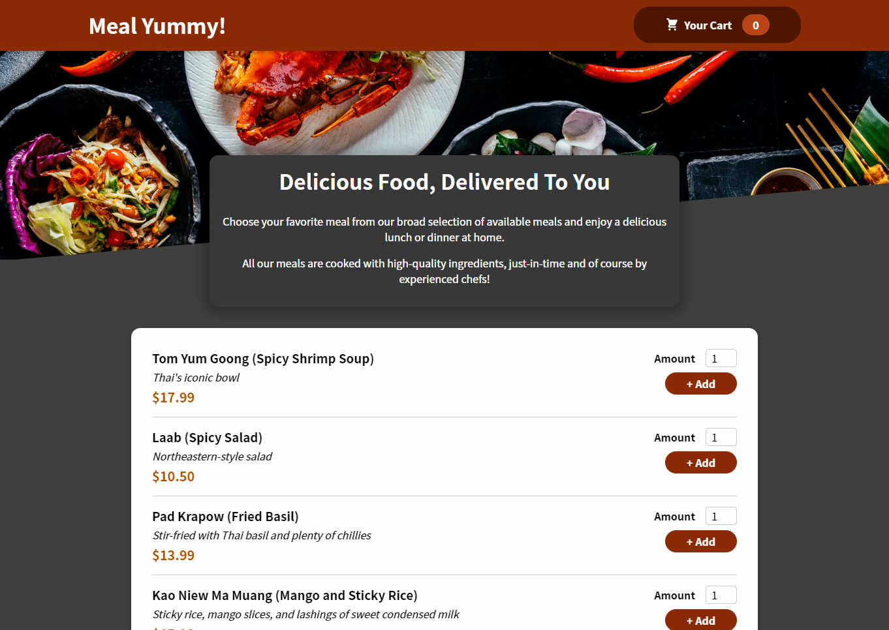

# Development of Food Order & Delivery Website

**Development of Food Order & Delivery Website** is project which is developed for using advanced frontend development concepts like React Hooks and other React features to develop website based on Food Delivery Business, using HTML, CSS, JavaScript and React JS

---

In the project directory, you must run these commands in terminal:

### `yarn` and `yarn start`

and open [http://localhost:3000](http://localhost:3000) to view it in the browser.
